<div align="center">


# Gabriel Azevedo

### Full Stack Developer · AI Systems Builder · Information Systems Student


I build products that go beyond the interface — systems with **context, control, memory and purpose**.

[](https://www.linkedin.com/in/gabriel-azevedo-6a2568230/)
[](https://github.com/Gabrieldev707)


<br/>


</div>

---

## About me

I’m Gabriel Azevedo, an Information Systems student and full stack developer based in Campina Grande, Brazil.

I work where **software engineering, AI systems, automation and product design** meet. I like building things that are useful before they are flashy: reliable APIs, background pipelines, local tools, agentic workflows and interfaces with a clear identity.

A system is only interesting to me if I can understand how it behaves when things go wrong. I care about **traceability, security boundaries, deterministic fallbacks, cost awareness and human control** — not hiding every decision behind a model call.

<div align="center">


</div>

---

## Current focus

```ts
const currentFocus = {
  product: "ProspectFlow",
  research: "Sentinela",
  localSystem: "ControlFawkes",
  orchestration: "OrcTech",
  visualExperiment: "Olimpo"
};
```

---

## Featured systems

<table>
<tr>
<td width="50%" valign="top">

### ProspectFlow

**Commercial Intelligence Platform**

Find companies, detect digital gaps, score opportunities and move a lead from research to proposal in one workflow.

The pipeline combines real company discovery, background enrichment, website analysis, an auditable **Opportunity Score**, CRM and proposal/PDF generation.

**Stack:** TypeScript · React · Fastify · PostgreSQL · Prisma · Redis · BullMQ · Docker · Playwright


</td>
<td width="50%" valign="top">

### Sentinela

**LLM Guardrail Research Lab**

A local, reproducible environment for studying **jailbreaks, data leakage and guardrails** with special attention to PT-BR evaluation.

It separates model output from post-guardrail delivery so experiments produce auditable evidence instead of vague “worked / failed” demonstrations.

**Focus:** Local models · Guardrail evaluation · Reproducibility · Auditability · PT-BR


</td>
</tr>

<tr>
<td width="50%" valign="top">

<div align="center">

</div>

### [ControlFawkes](https://github.com/Gabrieldev707/ControlFawkes)

**Local Computer Control**

A mobile-first local controller connecting an iPhone to a computer with authenticated WebSockets, touchpad, keyboard, media controls, platform launching and deterministic commands.

Ollama is an **optional local fallback**, not a dependency for the product to work.

**Stack:** React · FastAPI · WebSockets · Python · Local networking · Ollama optional


</td>
<td width="50%" valign="top">

### OrcTech

**Agentic Creation Lab**

A private workspace for turning ideas into software through structured agent workflows, project memory, execution, QA and security gates.

The point is orchestration rather than “one chatbot doing everything”: explicit phases, approval boundaries, execution ownership, cost control and fallback paths are first-class parts of the system.

**Stack:** React · TypeScript · Node.js · Express · Supabase · PostgreSQL · Python · FastAPI


</td>
</tr>

<tr>
<td colspan="2" valign="top">

### [Olimpo](https://github.com/Gabrieldev707/Olimpo)

**Interactive Mythology Experience** — a visual web experiment built around Greek gods, ancient art direction and immersive interface work. It gives me a place to push frontend identity, motion and storytelling much further than a conventional product dashboard.

**Stack:** React 19 · Vite · Tailwind CSS · Motion


</td>
</tr>
</table>

<div align="center">

**More public work:** [AddressManager](https://github.com/Gabrieldev707/AddressManager) · [CuidarMais](https://github.com/Gabrieldev707/CuidarMais) · [EcoScan](https://github.com/Gabrieldev707/EcoScan) · [DireitoVivo](https://github.com/Gabrieldev707/DireitoVivo)

</div>

---

## GitHub activity

<div align="center">


<br/>


</div>

---

## Tech stack

### Core engineering

<div align="center">


</div>

### Backend, data & execution

<div align="center">


</div>

### AI & local systems

<div align="center">


</div>

### Frontend, deploy & tools

<div align="center">


<br/>


</div>

---

## What drives me

I like systems that have a **clear reason to exist**.

That can be a polished full-stack product, a local tool that removes friction, an AI workflow with explicit boundaries, or an experiment that turns unclear behavior into measurable evidence. The stack changes; the principle does not.

> **AI is not the product by default.**  
> It belongs where it earns the complexity — while the system stays understandable, testable and under human control.

<div align="center">

### `build → test → understand → improve → ship`

**Build systems that solve real problems — and make them feel alive.**


</div>
