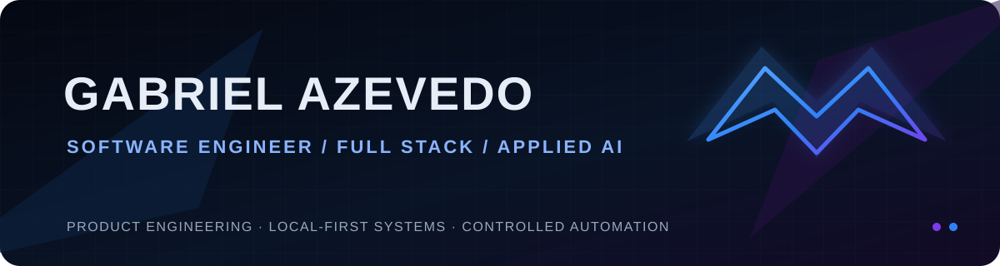

  

  I build end-to-end products, local-first tools and applied AI systems with an emphasis on reliability, traceability and human control.

  
  
  

## About

I am an Information Systems student and Full Stack / Software Engineer based in Campina Grande, Brazil. I work across product engineering, automation and applied AI—from user experience and data modeling to backend reliability, asynchronous processing and controlled execution.

I am especially interested in systems that stay understandable as they grow: explicit boundaries, deterministic fallbacks, observable decisions and AI that earns its place in the architecture.

## Selected systems

<table>
  <tr>
    <td width="50%" valign="top">
      <h3>SerraClub</h3>
      
Commercial product · Private

      
A multi-role relationship platform built for a real business. It connects club administration, partner companies and professionals through sales, points, rewards, finance and notification workflows.

      
<code>React</code> <code>TypeScript</code> <code>Node.js</code> <code>Express</code> <code>MongoDB</code> <code>Playwright</code>

    </td>
    <td width="50%" valign="top">
      <h3>Nodus</h3>
      
Active development · Private

      
A local-first desktop workspace that connects technical discussion to structured execution, with profile-backed runs, explicit approval boundaries and a visual canvas for project context.

      
<code>TypeScript</code> <code>React</code> <code>Electron</code> <code>Node.js</code> <code>Vitest</code>

    </td>
  </tr>
  <tr>
    <td width="50%" valign="top">
      <h3>ProspectFlow</h3>
      
Active · Private

      
A B2B commercial-intelligence platform for company discovery, auditable opportunity scoring, background enrichment, CRM pipelines and proposal generation.

      
<code>TypeScript</code> <code>React</code> <code>Fastify</code> <code>PostgreSQL</code> <code>Redis</code> <code>BullMQ</code>

    </td>
    <td width="50%" valign="top">
      <h3><a href="https://github.com/Gabrieldev707/ControlFawkes">ControlFawkes</a></h3>
      
Functional MVP · Public

      
Secure local iPhone-to-computer control with authenticated WebSockets, deterministic commands, touchpad and keyboard input, media controls and optional local-language interpretation.

      
<code>React</code> <code>FastAPI</code> <code>Python</code> <code>WebSockets</code> <code>Ollama</code>

    </td>
  </tr>
  <tr>
    <td width="50%" valign="top">
      <h3>Sentinela</h3>
      
Active development · Private

      
A reproducible research and engineering environment for studying jailbreaks, data leakage and guardrails, with evidence-first evaluation and a strong PT-BR and local-model focus.

      
<code>Python</code> <code>Local LLMs</code> <code>Evaluation</code> <code>Guardrails</code> <code>Reproducible research</code>

    </td>
    <td width="50%" valign="top">
      <h3><a href="https://github.com/Gabrieldev707/EcoScan">EcoScan</a></h3>
      
Academic product · Public

      
A mobile and web platform for waste classification, disposal guidance, community alerts and nearby collection points, combining camera-based AI with reliable local fallbacks.

      
<code>React Native</code> <code>Expo</code> <code>TypeScript</code> <code>Express</code> <code>MongoDB</code> <code>Vision AI</code>

    </td>
  </tr>
</table>

  
<strong>More public work</strong>

- **[DireitoVivo](https://github.com/Gabrieldev707/DireitoVivo)** — privacy-first conversational access to Brazilian public rights and services; its frontend is currently being refined.
- **[CuidarMais](https://github.com/Gabrieldev707/CuidarMais)** — a multi-role platform connecting families with support homes, including maps, applications and visit scheduling.
- **[Jordan / AIR 23](https://github.com/Gabrieldev707/Jordan)** — an interactive editorial experiment focused on art direction, motion and frontend craft.
- **[AddressManager](https://github.com/Gabrieldev707/AddressManager)** — an ASP.NET Core MVC address-management application built as a focused technical challenge.

## Core stack

  
  
  
  
  
  
  
  
  
  
  
  

**Applied AI:** local models, retrieval and memory, structured agent workflows, evaluation systems, guardrails and deterministic fallbacks.

## How I build

- Treat frontend, backend, data and operations as one product system.
- Prefer explicit control boundaries over opaque automation.
- Keep important decisions observable, testable and auditable.
- Use AI where it improves the product—not where a deterministic rule is better.

## Contribution trail

  <picture>
    <source media="(prefers-color-scheme: dark)" srcset="https://raw.githubusercontent.com/Gabrieldev707/Gabrieldev707/output/github-contribution-grid-snake-dark.svg" />
    <source media="(prefers-color-scheme: light)" srcset="https://raw.githubusercontent.com/Gabrieldev707/Gabrieldev707/output/github-contribution-grid-snake.svg" />
    
  </picture>

  <strong>Build systems that solve real problems—and keep humans in control.</strong>

